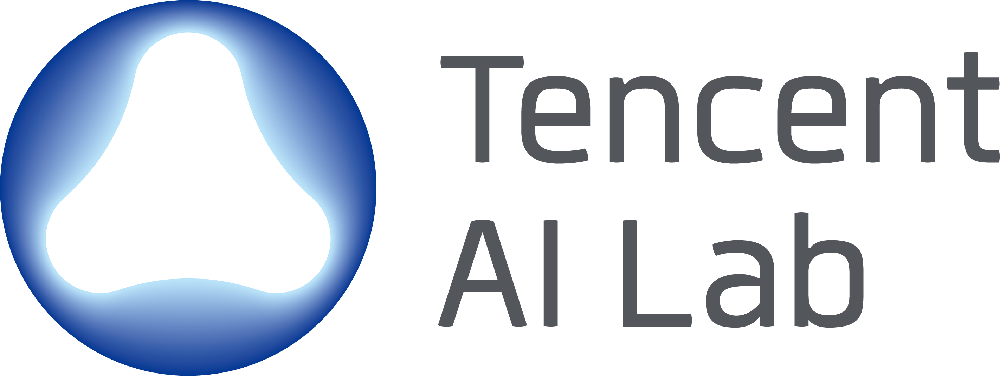

# Tencent AI LAB - Self-Improving Agent

We present the code of our academic papers of self-evolving agent:

- `WebEvolver`: [WebEvolver: Enhancing Web Agent Self-Improvement with Coevolving World Model](https://arxiv.org/abs/2504.21024), EMNLP 2025
- `WebCoT`: [WebCoT: Enhancing Web Agent Reasoning by Reconstructing Chain-of-Thought in Reflection, Branching, and Rollback](https://arxiv.org/abs/2505.20013), Findings of EMNLP 2025.
- `VScan`: [VScan: Rethinking Visual Token Reduction for Efficient Large Vision-Language Models](https://arxiv.org/abs/2505.22654), TMLR 2026

### Friendly links to follow-up works:

- [Cognitive Kernel-Pro: A Framework for Deep Research Agents and Agent Foundation Models Training](https://github.com/Tencent/CognitiveKernel-Pro).
