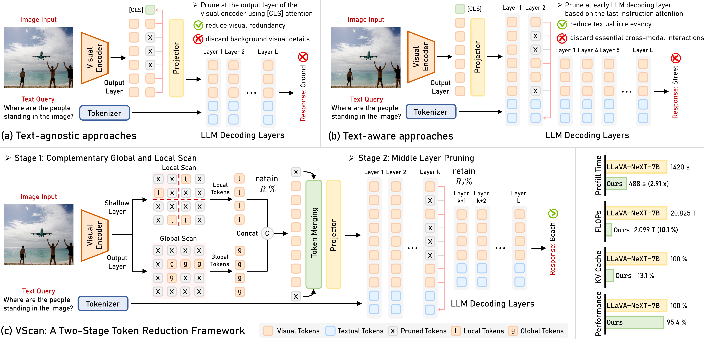

# [TMLR 2026] VScan: Rethinking Visual Token Reduction for Efficient Large Vision-Language Models

[](https://zhangce01.github.io/VScan/) [](https://arxiv.org/abs/2505.22654) []([https://iclr.cc/](https://jmlr.org/tmlr/)) [](https://opensource.org/licenses/MIT)


## 👀Introduction

This repository contains the code for our arXiv preprint `VScan: Rethinking Visual Token Reduction for Efficient Large Vision-Language Models`. [[Paper](https://arxiv.org/abs/2505.22654)]



## 📢Highlights
- 💡We conduct *comprehensive analyses* to reveal how visual knowledge evolves *throughout the entire LVLM*, offering insights to inform the design of more effective visual token reduction strategies.
- 🔥We introduce *VScan*, a two-stage training-free visual token reduction framework that progressively eliminates unimportant visual tokens to reduce both visual redundancy and textual irrelevance.
- 🚀Extensive evaluations across sixteen benchmarks demonstrate that VScan *consistently outperforms state-of-the-art methods* in maintaining robust performance under constrained token budgets. Notably, when applied to LLaVA-NeXT-7B, VScan achieves a *2.91x speedup* in prefilling and a *10x reduction* in FLOPs, while *retaining 95.4\% of the original performance*.


## ⏳Environment and Setup

We test our codebase with Python 3.10.17, PyTorch 2.1.2, and CUDA 12.1. Please install corresponding PyTorch and CUDA versions according to your computational resources. 

You can use the following command to install the required packages:
```bash
# Create a conda environment
conda create -n vscan python=3.10 -y
conda activate vscan

# Install the required packages
pip install --upgrade pip  # enable PEP 660 support
pip install -e .
```

Note that for experiments using Qwen-2.5-VL, you may need a higher version of `transformers`. Please follow the instructions in [Qwen-2.5-VL codebase](https://github.com/QwenLM/Qwen2.5-VL) to install the required packages. We recommend to create a new conda environment for Qwen-2.5-VL to avoid version conflicts.
```bash
# You need higher version of transformers for Qwen-2.5-VL
pip install transformers==4.51.3 accelerate
pip install qwen-vl-utils[decord]
```


Our VScan is compatible with FlashAttention. If you want to try our method with FlashAttention, please install the FlashAttention package with the following command:
```bash
pip install flash-attn --no-build-isolation
```
If this doesn't work on your device, try directly specifying a compatible wheel: [FlashAttention Releases](https://github.com/Dao-AILab/flash-attention/releases). For example, you can use the following command:
```bash
pip install flash_attn-2.7.2.post1+cu12torch2.1cxx11abiFALSE-cp310-cp310-linux_x86_64.whl --no-build-isolation
```

Don't forget to set `use_flash_attn=True` in `load_pretrained_model()` to enable FlashAttention.

## 📈Models and Benchmarks

#### 🤗Models
We apply our VScan to the following models with different architectures. You can find the model checkpoints in the HuggingFace Model Hub. We also provide the GitHub links for the original model implementations.
| Model | Checkpoint |GitHub |
|----------|:-----------:|:-----------:|
| LLaVA-1.5-7B |  [liuhaotian/llava-v1.5-7b](https://huggingface.co/liuhaotian/llava-v1.5-7b) | https://github.com/haotian-liu/LLaVA|
| LLaVA-NeXT-7B |  [liuhaotian/llava-v1.6-vicuna-7b](https://huggingface.co/liuhaotian/llava-v1.6-vicuna-7b) | https://github.com/haotian-liu/LLaVA|
| Qwen-2.5-VL-7B |  [Qwen/Qwen2.5-VL-7B-Instruct](https://huggingface.co/Qwen/Qwen2.5-VL-7B-Instruct) | https://github.com/QwenLM/Qwen2.5-VL |
| Video-LLaVA-7B |  [LanguageBind/Video-LLaVA-7B](https://huggingface.co/LanguageBind/Video-LLaVA-7B) | https://github.com/PKU-YuanGroup/Video-LLaVA|


#### 📚Benchmarks
We evaluate our VScan on 9 image understanding benchmarks and 3 referring grounding benchmarks.

**For image understanding benchmarks**: Please refer to [Evaluation.md](https://github.com/haotian-liu/LLaVA/blob/main/docs/Evaluation.md) provided by the [LLaVA codebase](https://github.com/haotian-liu/LLaVA) for instructions on to dataset preparation. You should first download [eval.zip](https://drive.google.com/file/d/1atZSBBrAX54yYpxtVVW33zFvcnaHeFPy/view?usp=sharing), which contains a general structure of all datasets.


**For the referring grounding benchmarks**: Please first download the [COCO train2014 image](https://huggingface.co/datasets/omlab/VLM-R1/resolve/main/train2014.zip) and unzip it to your data folder. Then, download the [RefCOCO/+/g annotation files](https://huggingface.co/datasets/omlab/VLM-R1/resolve/main/rec_jsons_processed.zip). We thank the authors of [VLM-R1](https://github.com/om-ai-lab/VLM-R1) for providing this.

## 🔧Implementation
**For LLaVA-1.5 and LLaVA-NeXT**, the code implementation is in `llava/model/`. 
- The core implementation for *complementary global and local scans* during the visual encoding stage is in `llava/model/llava_arch.py`. You can find the detailed code implementation in `LlavaMetaForCausalLM.encode_images(self, images)`.
- The core implementation for *middle layer pruning* during the LLM decoding stage is in `llava/model/modeling_llama_x.py`.  You can find the detailed code implementation in `LlamaModel.forward_x(self, *args)` and `LlamaModel.layer_prune(*args)`.


**For Qwen-2.5-VL**, the code implementation is in `qwen/model/`.
- The core implementation for *complementary global and local scans* during the visual encoding stage is in `qwen/model/qwen2_5_vl_custom.py`. You can find the detailed code implementation in `Qwen2_5_VisionTransformerPretrainedModel_X.forward(self, *args)`.
- The core implementation for *middle layer pruning* during the LLM decoding stage is also in `qwen/model/qwen2_5_vl_custom.py`.  You can find the detailed code implementation in `Qwen2_5_VLModel_X.forward(self, *args)` and `Qwen2_5_VLModel_X.layer_prune(*args)`.

## 📦Usage

You can run the experiment using our provided scripts in `scripts/`. 

**For LLaVA-1.5 and LLaVA-NeXT, the script should look like this:**
```bash
python -m llava.eval.model_vqa_loader \
    --model-path ../data/model/llava-v1.5-7b \
    --question-file ../data/eval/MME/llava_mme.jsonl \
    --image-folder ../data/eval/MME/MME_Benchmark_release_version/MME_Benchmark \
    --answers-file ../data/eval/MME/answers/llava-v1.5-7b.jsonl \
    --temperature 0 \
    --layer_list '[16]' \
    --image_token_list '[32]' \
    --visual_token_num 96 \
    --conv-mode vicuna_v1
```
You should replace the `--model-path` with the path to your model checkpoint. The `--question-file` should point to the question file you want to evaluate, and the `--image-folder` should point to the folder containing the images. The `--answers-file` should point to the file where you want to save the answers. Then, you can specify the `--layer_list`, `--image_token_list`, and `--visual_token_num` according to your needs. By default, we set `--layer_list` to `[16]`, `--image_token_list` to `[32]`, and `--visual_token_num` to `96` (*i.e.*, 96 tokens are retained during the visual encoding stage, and further reduced to 32 at the 16th LLM decoding layer) to keep an average of 64 tokens throughout the 32 layers.
Note that our `--layer_list` and `image_token_list` support multiple values. For example, you can set `--layer_list` to `[8, 16]` and `--image_token_list` to `[188, 96]` to reduce the visual tokens at multiple layers like [PyramidDrop](https://github.com/Cooperx521/PyramidDrop).


**For Qwen-2.5-VL, the script should look like this:**
```bash
python -m qwen.eval.model_vqa_loader \
    --model-path ../data/model/Qwen2.5-VL-7B-Instruct \
    --question-file ../data/eval/MME/llava_mme.jsonl \
    --image-folder ../data/eval/MME/MME_Benchmark_release_version/MME_Benchmark \
    --answers-file ../data/eval/MME/answers/Qwen2.5-VL-7B-Instruct.jsonl \
    --temperature 0 \
    --layer-list '[14]' \
    --image-token-ratio-list '[0.333]' \
    --image-token-ratio 0.167 
```
This is because Qwen-2.5-VL employs dynamic resolution processing, resulting in a varying number of visual tokens across different images. Therefore, we set `--image-token-ratio-list` to `[0.333]` and `--image-token-ratio` to `0.167` for Qwen-2.5-VL, which means that 16.7% of the visual tokens are retained during the visual encoding stage, and further reduced to 33.3% at the 14th LLM decoding layer. This results in an average of 11.1% of the visual tokens being retained throughout the 28 layers. Note that for RefCOCO/+/g, please directly specify these parameters in the `qwen.eval.test_refcoco` script. The default values are set to `layer_list = '[14]'`, `image_token_ratio_list = '[0.67]'`, and `image_token_ratio = 0.6` in the script to maintain an average reduction rate of 50%.

**Then, you can run the experiments by the following commands:**
```bash
# For GQA and VQAv2, we support multi-GPU inference
CUDA_VISIBLE_DEVICES=0,1,2,3,4,5,6,7 bash scripts/llava1_5/gqa.sh

# For other datasets, we only support single-GPU inference
CUDA_VISIBLE_DEVICES=0 bash scripts/llava1_5/mme.sh

# For Qwen-2.5-VL on RefCOCO/+/g, we support multi-GPU inference
CUDA_VISIBLE_DEVICES=0,1,2,3,4,5,6,7 torchrun --nproc_per_node=8 -m qwen.eval.test_refcoco
```

## 🙏Acknowledgements

Our codebase is adapted from [PyramidDrop](https://github.com/Cooperx521/PyramidDrop) and [FasterVLM](https://github.com/Theia-4869/FasterVLM). We thank the authors for releasing their code! We also thank the authors of [LLaVA](https://github.com/haotian-liu/LLaVA) and [Qwen-2.5-VL](https://github.com/QwenLM/Qwen2.5-VL) for their open-sourced models and well-written instructions.

## 📧Contact

If you have any questions, please contact at [cezhang@cs.cmu.edu](mailto:cezhang@cs.cmu.edu).

## 📌 BibTeX & Citation

If you find this paper and code useful, please kindly cite our work:

```bibtex
@article{zhang2025vscan,
  title={VScan: Rethinking Visual Token Reduction for Efficient Large Vision-Language Models},
  author={Zhang, Ce and Ma, Kaixin and Fang, Tianqing and Yu, Wenhao and Zhang, Hongming and Zhang, Zhisong and Xie, Yaqi and Sycara, Katia and Mi, Haitao and Yu, Dong},
  journal={arXiv preprint arXiv:2505.22654},
  year={2025}
}
```
