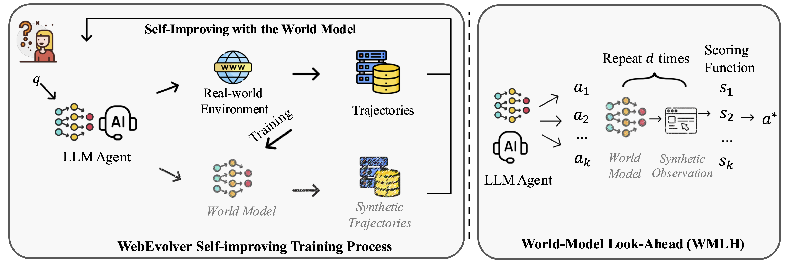

# WebEvolver: Enhancing Web Agent Self-Improvement with Coevolving World Model

[](https://arxiv.org/abs/2504.21024) [](https://opensource.org/licenses/MIT)

## 👀Introduction

This repository contains the code for our arXiv preprint `WebEvolver: Enhancing Web Agent Self-Improvement with Coevolving World Model`. [[Paper](https://arxiv.org/abs/2504.21024)].



## ⏳Environment and Setup

Detailed configurations please refer to the main system of [Cognitive Kernel](https://github.com/Tencent/CogKernel).

### Host agent service

**Configure `cognitive_kernel_v2/docker-compose.yml`:**

- Set `MODEL_NAME` to either the OpenAI model name (e.g., `gpt-4`, `gpt-3.5-turbo`) or `'ck'` if you are using the self-hosted vLLM service.
- Set `SERVICE_IP` to the IP address and port of your vLLM server (e.g., `192.168.1.100:8000`).
- Set `WORLD_MODEL_IP` to the IP address and port of the vLLM world model service.

**OpenAI configuration arguments:**

- `OPENAI_API_KEY`: Your OpenAI API key.
- `USE_AZURE`: Set to `true` if using Azure OpenAI service, otherwise `false`.
- `OPENAI_BASE_URL`: The base URL for the OpenAI or Azure endpoint.
- `GPT_MODEL`: The OpenAI GPT model name to use (e.g., `gpt-4`).

---

**After configuring the file, run the following commands to build and start the agent service:**

```bash
sudo docker-compose build
docker-compose up
```


## ⏳ Self-improvement

### 1. Trajectory Sampling with OpenWebVoyager

**Step 1: Prepare Query Data**

- Download the [OpenWebVoyager queries](https://github.com/MinorJerry/OpenWebVoyager/tree/main/WebVoyager/data_for_training/IL).
- Place the downloaded files into the `data/query` directory.

**Step 2: Sample Trajectories**

Once the agent service is running, execute:

```bash
cd cognitive_kernel_v2/openwebvoyager
mkdir -p ./output_traj
PYTHONPATH=.. python trajectory_sampling.py --query_path ../data/query/your_query.jsonl --output_path ./output_traj
```

> Replace `your_query.jsonl` with the actual query filename you wish to use.

---

### 2. Process Trajectories for SFT Data

#### 2.1. Convert to Agent Policy Model Data

```bash
python data/get_sft_data_from_trajectory.py --traj_path path1 path2 --output_path /output/path
```

- `--traj_path` can accept one or more trajectory files.

#### 2.2. Convert to World Model Training Data

**Step 1: Distill Rationales**

```bash
python data/world_model_sft_data_construction.py --history_action_observation_path /path/to/trajectories --output_path /output/path --model_service <vLLM_service_IP:port>
```

- `--model_service` should be set to the IP and port of your vLLM service (the base model for self-improvement).

**Step 2: Fine-tune Your Model**

- Use your preferred LLM fine-tuning framework to train the models with the generated data.

#### 2.3. Generate Synthetic Trajectories Using the World Model

```bash
python data/traj_synthesizing_world_model.py --world_model_service <world_model_service> --policy_model_service <policy_model_service> --input_query /path/to/query --output_dir /path/to/output
```

- After collecting synthetic trajectories, process them again with `data/get_sft_data_from_trajectory.py` to obtain SFT data.

---

**Tip:**  
Replace all placeholder paths and service addresses with your actual file locations and service endpoints.

### Inference

#### Inference on SimpleQA/GAIA-web

```python
# GAIA
cd cognitive_kernel_v2/evaluation
PYTHONPATH=.. python generation_gaia_web_new.py --query_path ../../data/query/xxx.jsonl  --output_path ./output_traj \
    --azure_endpoint ENDPOINT \
    --api_key API_KEY \
    --api_version "2024-02-01"
```


#### Inference on WebVoyager/Mind2Web

```python
# simpleqa
python evaluation/generate_webvoyager_mind2web_new.py --query_path ../data/webvoyager/WebVoyager_data.jsonl  --output_path ./output_traj/webvoyager/gpt-4o \
    --azure_endpoint ENDPOINT \
    --api_key API_KEY \
    --api_version "2024-02-01"
```

### Automatic Evaluation.

Use the function `auto_eval_by_gpt4o` in `cognitive_kernel_v2/evaluation/eval_webvoyager.py`.


## Data

The SFT dataset for the WebEvolver agent policy model and the world model can be found [here](https://huggingface.co/datasets/CognitiveKernel/WebEvolver).
 
## 📌 BibTeX & Citation

If you find this paper and code useful, please kindly cite our work:

```bibtex
@article{fang2025webevolver,
  title={WebEvolver: Enhancing Web Agent Self-Improvement with Coevolving World Model},
  author={Tianqing Fang and Hongming Zhang and Zhisong Zhang and Kaixin Ma and Wenhao Yu and Haitao Mi and Dong Yu},
  journal={arXiv preprint arXiv:2504.21024},
  year={2025}
}
```
